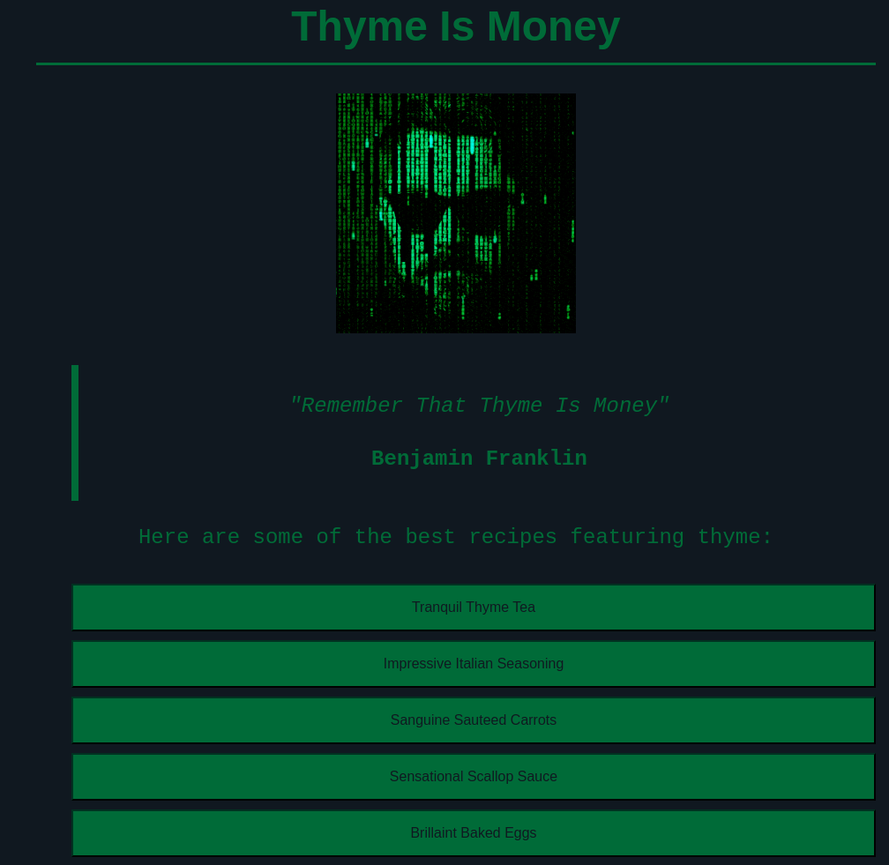
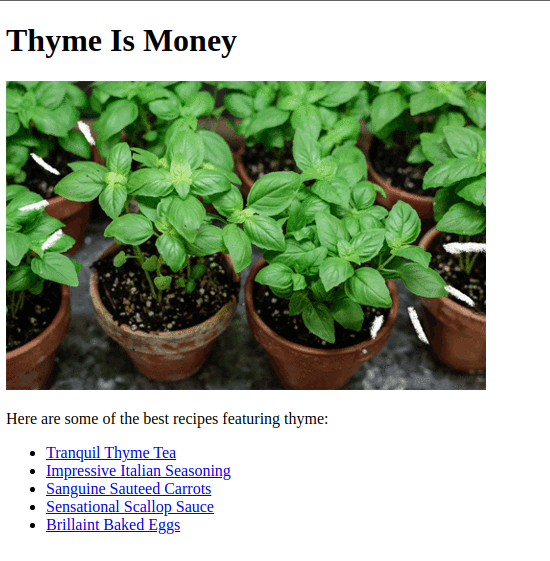

# Thyme Is Money 
Simple first project all about documenting recipes featuring the herb thyme.
You can find a live demo [_here_](https://stakhey.github.io/ThymeIsMoney/).
## Table Of Contents
- [General Information](#general-information)
- [Technologies Used](#technologies-used)
- [Screenshots](#screenshots)
- [Room For Improvement](#room-for-improvement) 
- [Credits](#acredits)
- [License](#license)
## General Information
This was my first project with HTML and CSS, so I decided to build something relatively simple as my skill base was still limited. I needed to consolidate my skills so I thought that a recipe page would be perfect, as it would require lots of different HTML tags, such as the ordered lists, and would allow some space for creatvity. The project aims to provide a place where you can find different recipes with thyme, because I wanted to have a play on words as the title of the project: Thyme Is Money. The main challenge of the project I had to overcome was to implement CSS that would complement the structure of the project, so I had to choose a good colour scheme, and figure out how to centre the webpage in order for it to have a cleaner look.
## Technologies Used 
- HTML5 
- CSS3
## Screenshots 
Here is a look at the current homepage:  
  
Here is a look at the original homepage:  

## Room For Improvement 
If I were to revisit the project in the future, I would: 
- Add 3-5 more recipe pages
- Improve the style of the headers
- Implement a light mode to contrast the default dark mode
- Figure out how to add a border to the images 
- Neaten up the quoteblock
## Credits
- The project idea and design brief came from the wonderful folks at [TheOdinProject](https://www.theodinproject.com/). 
- The page layout was inspired by [Yokaion](https://github.com/yokaion/odin-recipes). 
- The recipes came from [A Couple Cooks](https://www.acouplecooks.com/)!
## Contact
Created by @Stakhey - feel free to contact me!
## License 
This project is open source and available under the [MIT License](https://choosealicense.com/licenses/mit/)